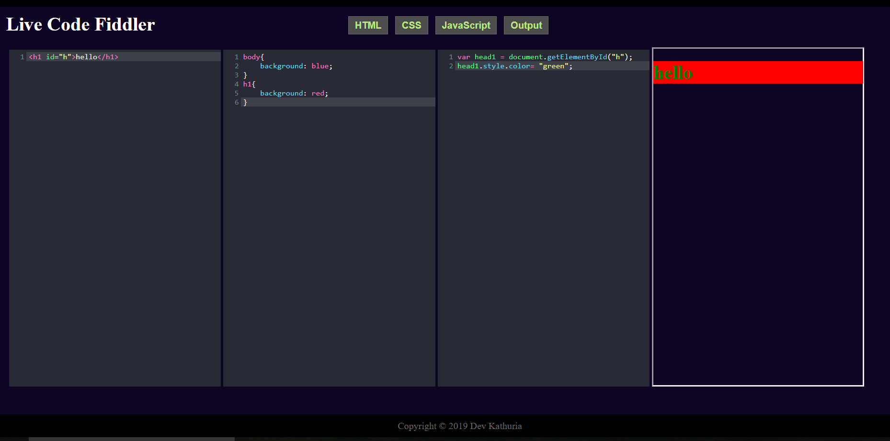
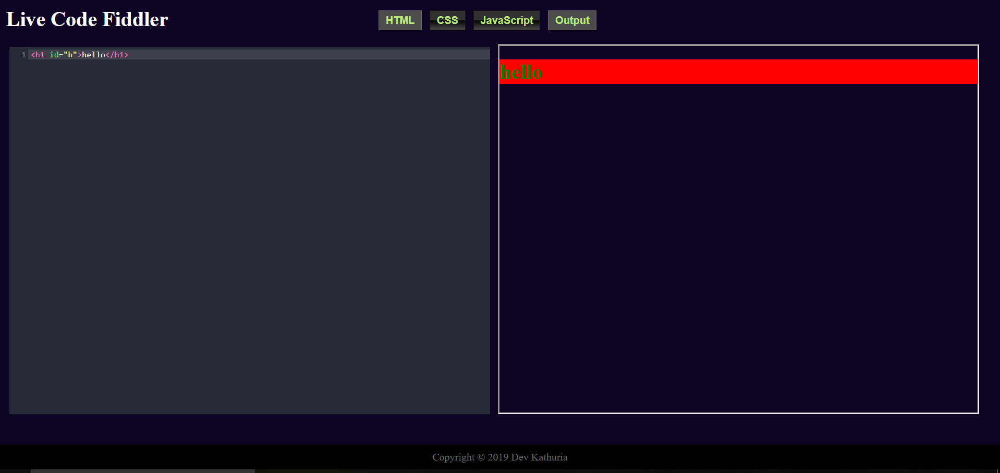

# Live-Code-Fiddler
> Live code playground to create an immersive web development environment on any device, anywhere!!

> Try it out at [Live-Code-Fiddler](http://live-code-fiddler.com.preview.services/)  💥💥💥
######  (site not yet optimized for mobile)

## Table of contents
* [Screenshots](#screenshots)
* [Technologies](#technologies)
* [Setup](#setup)
* [Features](#features)
* [Contact](#contact)

## Screenshots

## Technologies
* HTML 5.0
* CSS 3.0
* JQuery 3.4.1 (custom ui 1.12.1 used)
* Plugin: Codemirror 5.48.0

## Setup
`Clone the repo and run index.html`

## Features
- Write code and get it rendered in real time
- External libraries can be attached via cloud
- Supports HTML, CSS & JavaScript

To-do list:
* Toggle buttons to change various aspects such as Theme/ autocomplete on-off etc
* Better responsiveness

## Contact
Created by [@devkathuria](https://github.com/Dev-eloperr) - feel free to contact me!
